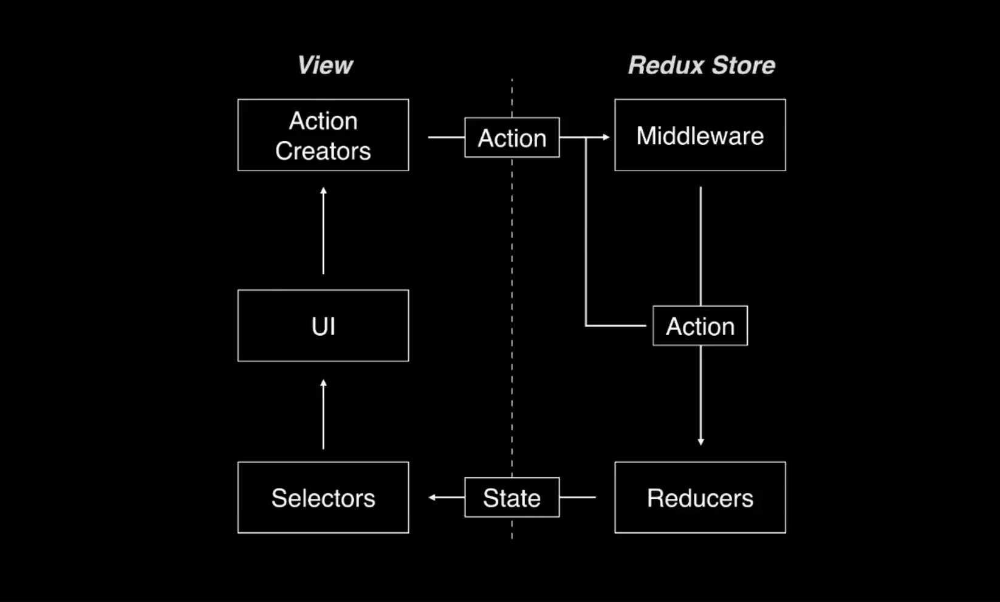
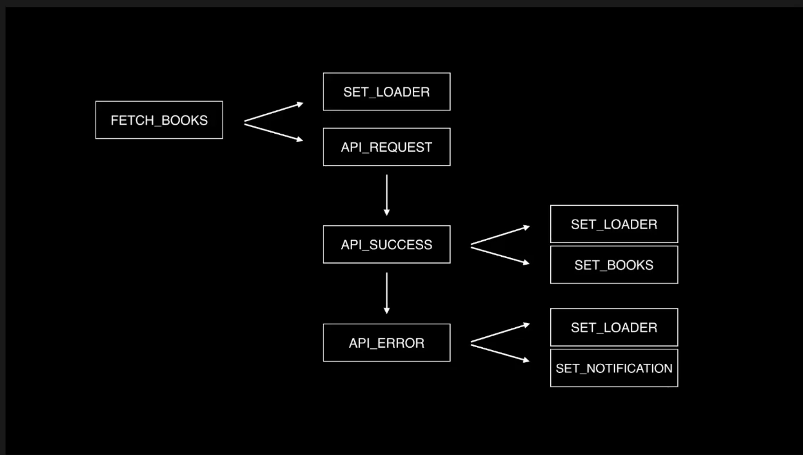
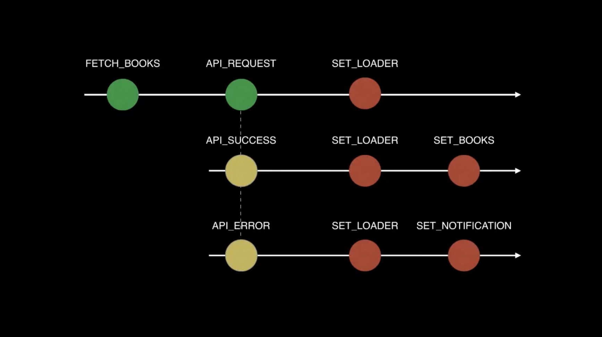
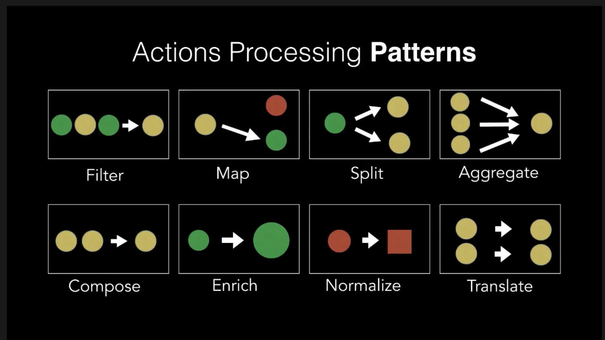

[Advanced Redux: Design Patterns and Practices - Nir Kaufman | JSHeroes 2018](https://www.youtube.com/watch?v=5gl3cCB_26M)

Command-query separation (CQS)
**Command**: method that change the state.
**Queries**: method that return a result.

> Redux is a...of a messaging system.

> 
> The only part in this pattern that accept an action and return an action is the middleware.

Categrize our methods into three different groups:
* Command actions
⋅⋅⋅Ask for something. Initial actions
* Event actions
⋅⋅⋅System event
* Document actions
⋅⋅⋅It has the final structure of the data. The only actions that the reducer process

> 

> 

Green: command; Yellow: Event; Red: Document
> 